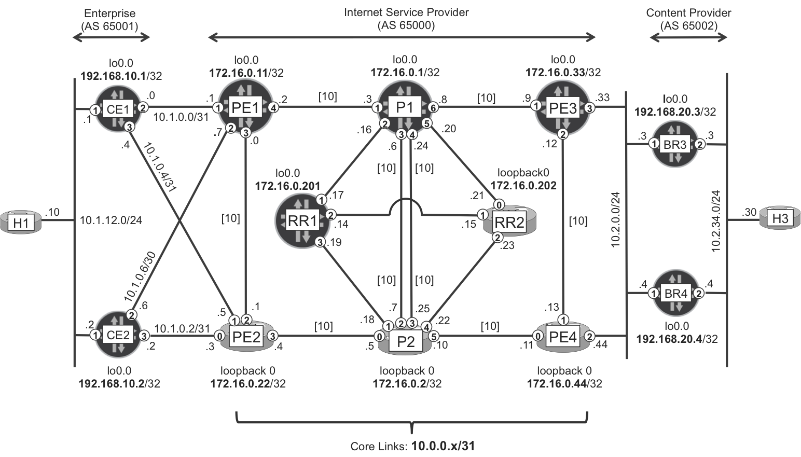

# "MPLS in the SDN Era" (Antonio Sanchez Monge / Krzysztof Szarkowicz)

Original topology from Ato/Krzysztof's famous MPLS book. Good to practice.

## Includes:

* vm.conf - Configuration for VMM to play with the topology
* baseline/ - Baseline configurations (interfaces + IS-IS only, no MPLS)

## How to Build on VMM:

**Login to VMM POD and do:**

	$ vmm config vm.conf -g vmm-default
	$ vmm bind && vmm start

**To load the baseline configuration:**

	$ cd baseline
	$ ./loadjuniper.sh

